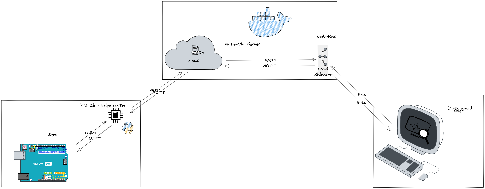
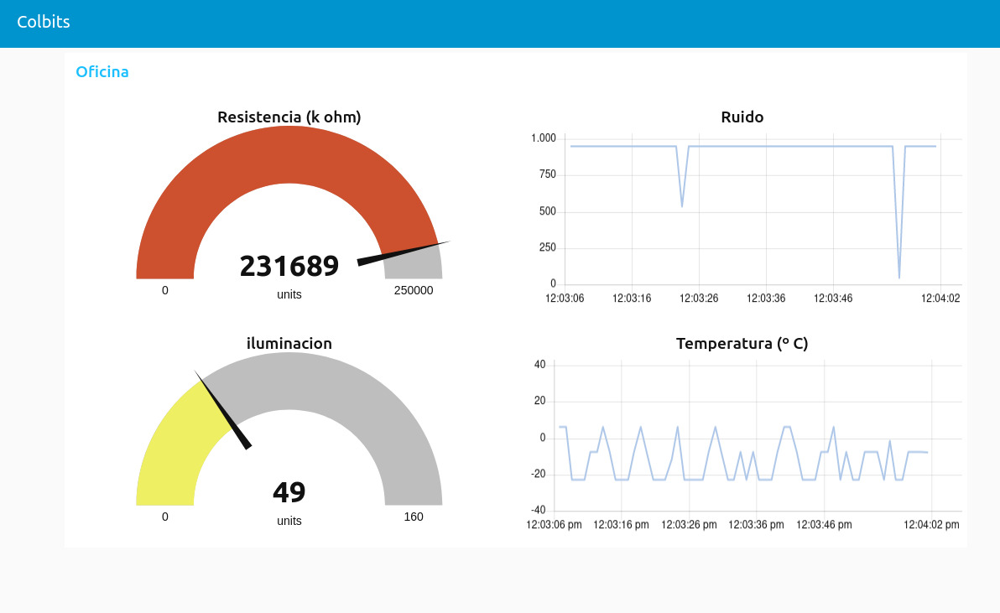

# 

# Docker-IOT: Arduino Sensor Data to Dockerized Node-RED Dashboard via MQTT

Welcome to the repository! Here you will find Arduino scripts designed to read data from various sensors and transmit this information to a Raspberry Pi using Bluetooth modules through serial communication. Subsequently, this data is processed and sent via MQTT to a Node-RED environment executed within Docker containers.

## Contents

- **Arduino Scripts:** Optimized scripts for various sensors that will allow you to gather essential data.
- **Python Script:** A Python script that reads data left on the serial port by Bluetooth communication on the Raspberry Pi.
- **Docker_compose:** Docker container configuration with MQTT broker and Node-RED framework.

## Components

- Arduino boards and corresponding sensors.
- Bluetooth module compatible with Arduino HC-05.
- Raspberry Pi 3B with Python and necessary libraries installed.
## Schematic

For a visual representation of the system architecture, refer to the schematic diagram provided in the: 

## Testing
**Node-RED Dashboard:** The Node-RED dashboard was  tested for responsiveness and real-time updates.

**MQTT Integration:** MQTT communication was validated by subscribing to and publishing data between different components of the system.
[Node-red](Img/053ec601-b63f-4b7d-a8a3-cbd59eb100c8.jpg)
 **Arduino and Sensors:**
[Conexion](Img/89f7e296-ad63-4d4b-8fb2-d9899b35ef57.jpg)
